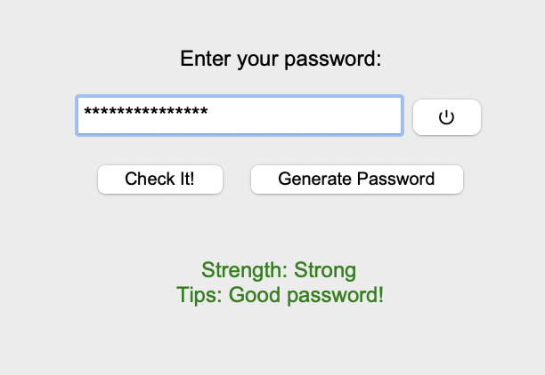
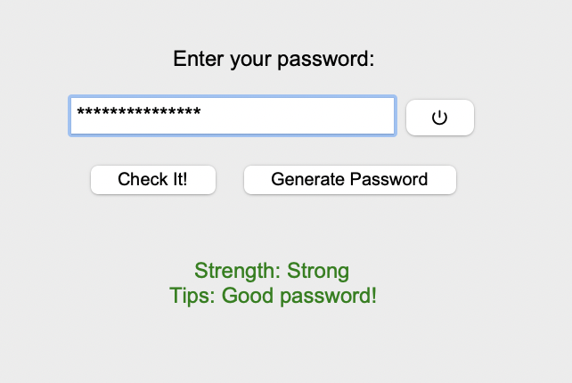
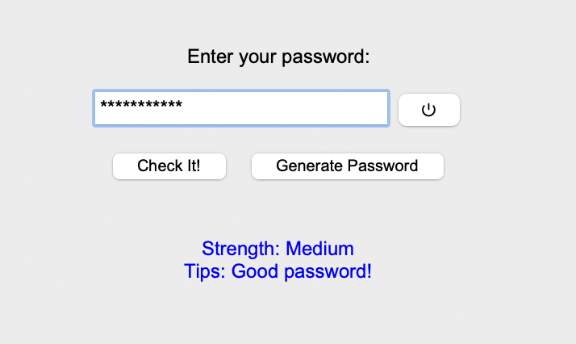
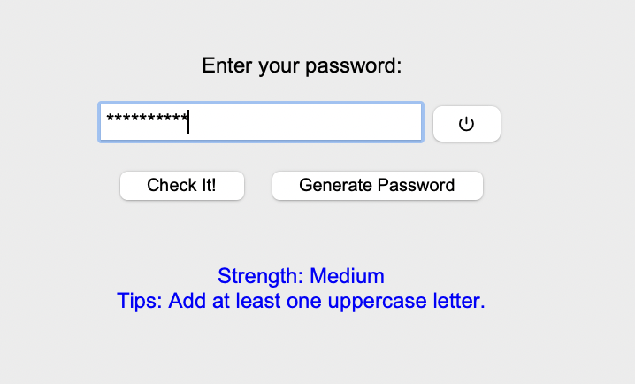
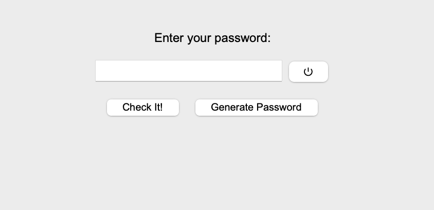

# Password Strength Checker

A GUI-based tool built with Python and Tkinter to analyze and generate strong passwords. This tool helps users evaluate the strength of their passwords and provides actionable suggestions for improvement.

## 🔐 Screenshots

### 🟥 Weak Password


### 🟧 Medium Password


### 🟩 Strong Password


### 💡 Suggestions for Improvement


### ⚙️ Generated Strong Password


## Features
- **Password Strength Analysis**: Classifies passwords as Weak, Medium, or Strong
- **Comprehensive Checks**:
  - Minimum length (8+ characters)
  - Uppercase and lowercase letters
  - Numbers and special characters
  - Avoidance of dictionary words
- **Smart Suggestions**: Provides specific feedback for improvement
- **Password Generation**: Creates random 15-character secure passwords
- **Visibility Toggle**: Show/hide password functionality

## Prerequisites
- Python 3.x
- NLTK library (for dictionary checks)

Install requirements:
```bash
pip install nltk
